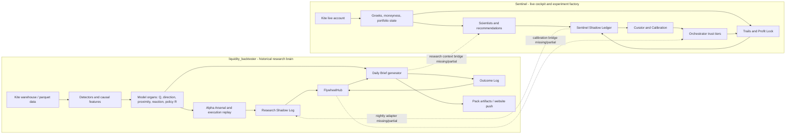
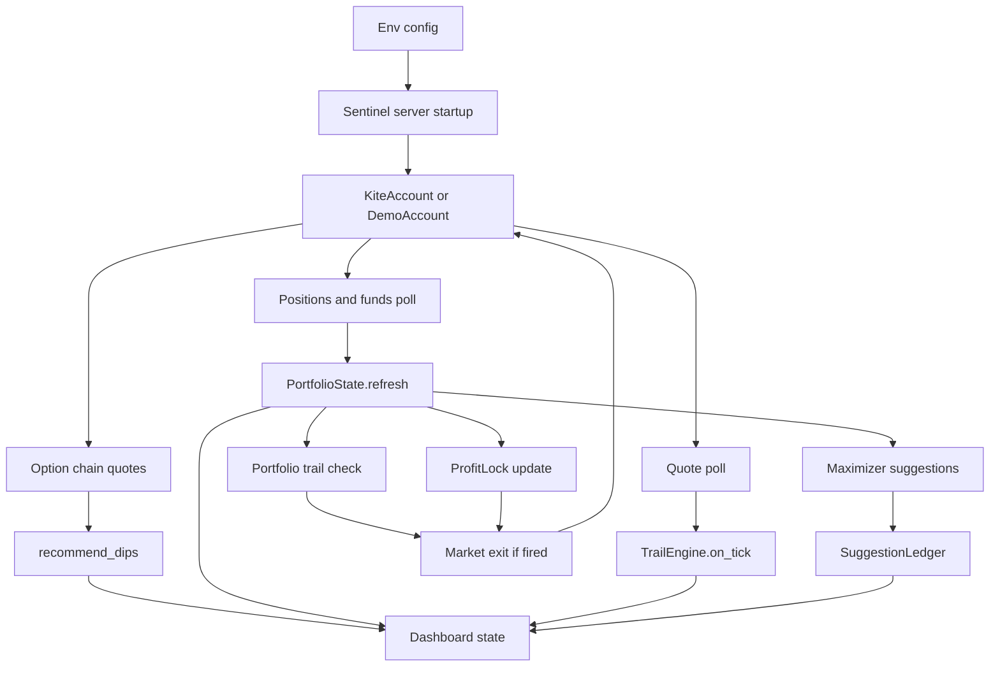
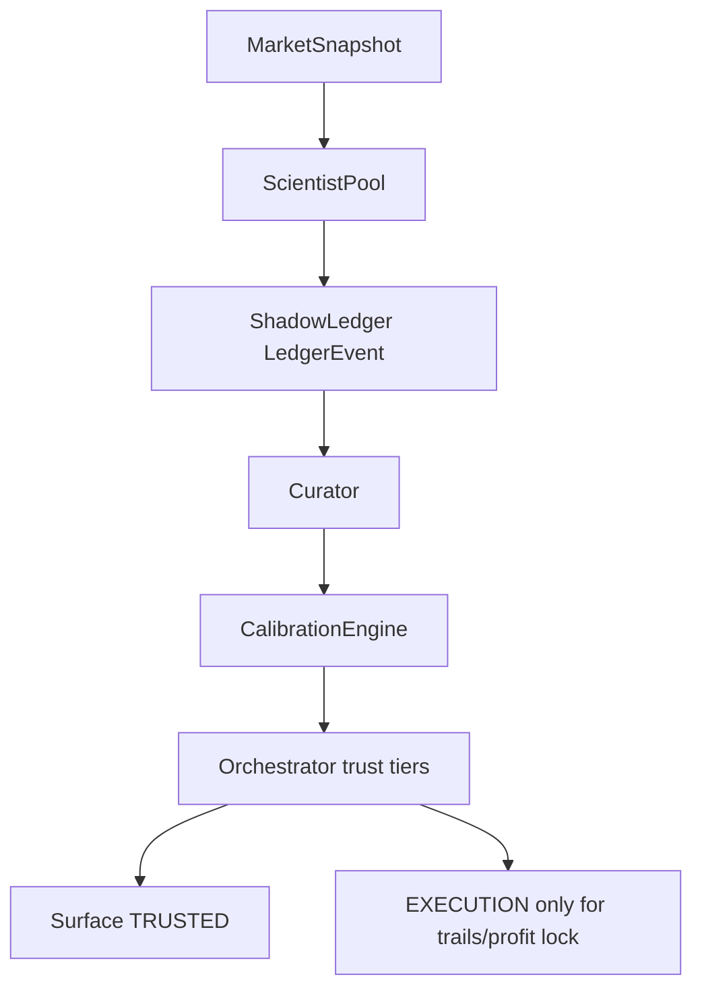
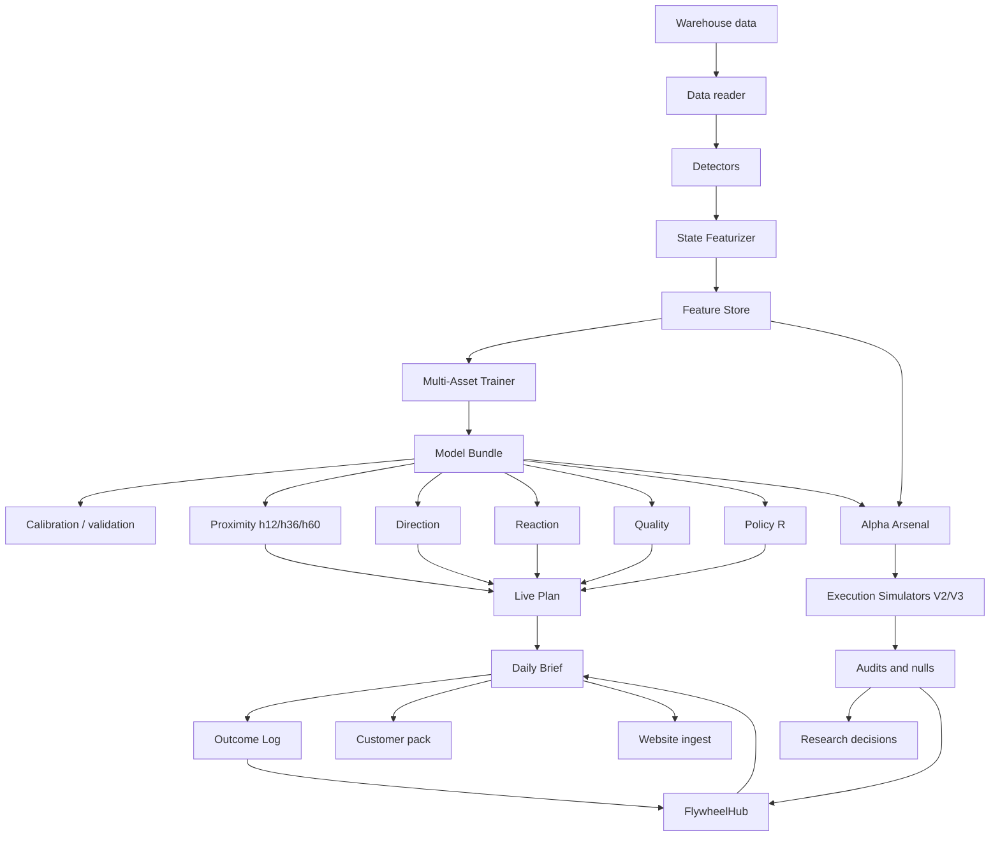
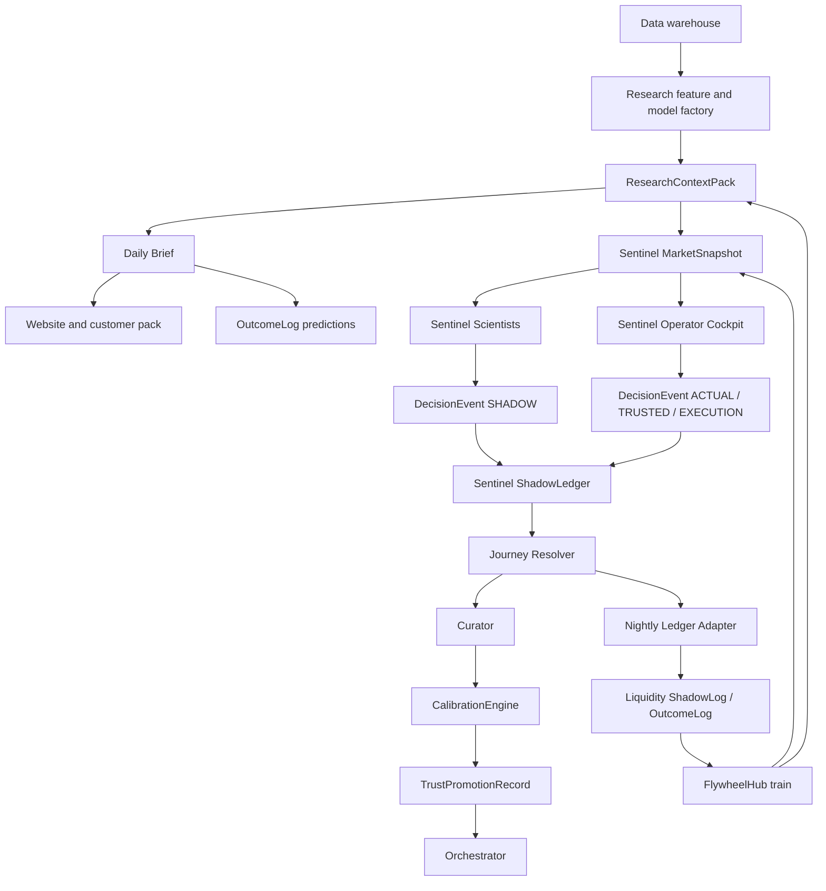
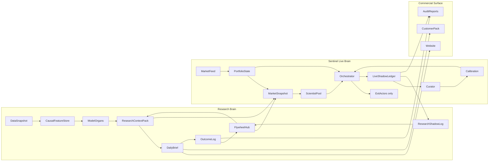

# Unified Sentinel + Liquidity Backtester Architecture Report For Claude Opus

Generated for: Claude Opus / Project Freedom coordination  
Generated by: Codex  
Date: 2026-06-13  
Scope: Sentinel live cockpit, liquidity_backtester research engine, website/customer product path, outcome/shadow/flywheel loops, and the proposed unified operating spine.

---

## 0. Executive Read

The project now has two powerful halves that are not yet one fully integrated organism.

1. `liquidity_backtester` is the historical research brain.
   It owns the data warehouse, causal feature production, model training, proximity/direction/reaction/policy heads, audits, Daily Brief, outcome log, customer packaging, and website publishing path.

2. `sentinel` is the live trading cockpit and live experiment factory.
   It owns the live account loop, positions, funds, option chain quotes, first-principles Greeks, scenario/what-if math, trailing exits, profit lock, Shadow Ledger, scientists, curator, calibration, leakage guard, and the trust-tier Orchestrator.

3. The biggest remaining flaw is not a single missing model. It is the missing common event spine.
   Both systems generate decisions, skips, predictions, executions, suggestions, and counterfactuals, but they do not yet speak one shared contract. Sentinel has a rich `LedgerEvent`. Liquidity backtester has `PredictionRecord`, `ShadowEvent`, alpha trades, policy labels, execution result frames, and Daily Brief blocks. These need a shared `DecisionEvent`, `ExecutionIntent`, and `OutcomeEvent` vocabulary.

4. The current architecture is directionally correct but underwired.
   Sentinel's `Orchestrator` exists and is well designed, but `sentinel.server` is still mostly a direct loop around `TrailEngine`, `ProfitLock`, `Maximizer`, `SuggestionLedger`, and `recommend_dips`. Liquidity backtester's `generate_brief()` supports `outcome_log_writer`, `shadow_log_writer`, `flywheel_hub`, website publishing, and options expected-return hooks, but the default runner currently wires only the outcome log in its standard Daily Brief call.

5. The most valuable next build is not another alpha.
   The next build should be the common nervous system:
   - shared decision schema,
   - Sentinel research context bridge,
   - Sentinel ledger to liquidity shadow/outcome adapter,
   - run manifest and artifact health,
   - FlywheelHub as a first-class artifact,
   - orchestration in the Sentinel hot path,
   - product-grade customer delivery and audit continuity.

---

## 1. Mental Model Of The Whole Universe

The whole project should be understood as one market-intelligence organism:

The intended loop is:

1. Historical data trains the research model.
2. The research model generates the Daily Brief and machine context.
3. The website/customer product receives the safe research surface.
4. Sentinel receives the richer private context surface.
5. Sentinel runs live and logs every actual, virtual, rejected, alternative, and counterfactual idea.
6. The ledger resolves journeys.
7. Curator and calibration extract truths.
8. Nightly bridge sends live ledger truth back into liquidity_backtester.
9. FlywheelHub trains on outcome, shadow, drift, and live experiment history.
10. Next day's research brief and Sentinel cockpit both improve.

The project becomes powerful when that loop is mechanical, audited, and hard to accidentally bypass.

---

## 2. Sentinel Current Architecture

### 2.1 Sentinel Current Purpose

Sentinel is a live trading copilot for the user's Zerodha account. It is not supposed to place entry trades autonomously. It protects positions, monitors the account, computes option analytics, generates recommendations, runs live experiments, and records everything into a shadow ledger.

The explicit safety rule:

- In v1, only trailing stop and profit lock can be `EXECUTION` tier.
- They only exit positions the operator already opened.
- All model/scientist/recommendation outputs are decision support or shadow research until the curator proves them.

### 2.2 Sentinel Current Inputs

#### 2.2.1 Environment And Configuration Inputs

From `sentinel.config` and server startup:

- Kite API key.
- Kite access token.
- Demo mode flag.
- Dry-run vs real-order flag.
- Max orders per day.
- Quote polling interval.
- Portfolio polling interval.
- Ledger resolve minutes.
- Dashboard token.
- Journal directory.
- Underlying selection, currently mainly NIFTY style option context.

These inputs decide whether Sentinel is a synthetic demo, live dry-run, or live order-capable exit cockpit.

#### 2.2.2 Live Broker Inputs

From `sentinel.kite_client.KiteAccount` or `DemoAccount`:

- Funds.
- Positions.
- Orders.
- Last traded price for spot.
- Option chain instruments.
- Batched quotes for held symbols.
- Batched quotes for option-chain contracts.
- Exit order endpoint for market exit orders.

The `RateLimiter` in `kite_client.py` is the broker safety interface. It limits quote and order calls and includes daily and per-minute order caps.

#### 2.2.3 Market/Portfolio Inputs

From positions plus quotes:

- Tradingsymbol.
- Quantity.
- Average price.
- LTP.
- PnL.
- Option type.
- Strike.
- Expiry.
- Underlying spot.
- Bid/ask/last if available.
- Instrument metadata from Kite.

These flow into:

- `PortfolioState`.
- `PositionView`.
- `PairView`.
- Greeks calculation.
- Scenario curve.
- What-if analysis.
- Suggestions.
- Trail checks.
- Profit lock checks.

#### 2.2.4 User Inputs Through Dashboard/API

The current server exposes operator actions:

- Arm a position trail.
- Update trail cushion.
- Cancel trail.
- Arm portfolio trail.
- Cancel portfolio trail.
- Arm profit lock.
- Cancel profit lock.
- Override direction: UP, DOWN, NEUTRAL, or auto.
- Trigger kill switch.
- Query state.
- Query what-if scenario.

These inputs are very important because they define the live human-in-the-loop boundary.

#### 2.2.5 Internal Analytical Inputs

Sentinel has modules that consume the live state:

- `greeks.py` consumes premium, spot, strike, expiry, option type, risk-free rate.
- `moneyness.py` consumes spot, strike, option type, expiry to produce ATM-relative identity.
- `portfolio.py` consumes positions, quotes, metas, spot, funds.
- `scenario_engine.py` consumes leg state plus scenario movement, time passage, IV movement.
- `institutional.py` consumes option strikes, IVs, OHLC arrays, returns, bid/ask, volume, OI, sizes.
- `advisor.py` consumes portfolio state and live premiums.
- `scientists.py` consumes `MarketSnapshot`, which can include trend, volatility, liquidity, model signal, reaction signal, option-chain state, and equity-weight divergence.
- `curator.py` consumes completed ledger rows.
- `calibration.py` consumes curator report plus ledger rows.
- `leakage_guard.py` consumes metric history and current metrics.

#### 2.2.6 Missing Or Partial Inputs

The current Sentinel architecture expects several inputs that are not yet fully wired:

- Research-codebase context into `MarketSnapshot`.
- Daily Brief levels and probabilities into live recommendations.
- Proximity, direction, reaction, and policy R from liquidity_backtester into Sentinel.
- Sector/regime context into Sentinel scientists.
- Options historical OHLCV for model training.
- Live option-chain history accumulated minute by minute for forward training.
- Execution feedback from actual live fills into the research flywheel.

### 2.3 Sentinel Current Outputs

#### 2.3.1 Dashboard Outputs

`sentinel.server` emits `/api/state` with:

- Demo flag.
- Dry-run flag.
- Kill-switch state.
- Portfolio snapshot.
- Scenario curve.
- Active trails.
- Portfolio trail state.
- Profit lock state.
- Suggestions.
- Suggestion ledger stats.
- Recommendations.
- Activity log.

The dashboard visualizes the live account, Greeks, PnL, trails, lock, suggestions, and recommendations.

#### 2.3.2 Broker Outputs

Only two paths should ever place orders:

- `TrailEngine` exit via `_exit_fn`.
- `ProfitLock` flatten via `_exit_fn`.

Output shape:

- Market exit order request.
- Simulated order if dry-run.
- Real order if `SENTINEL_CONFIRM_REAL=1`.
- Activity log row.

No scientist, model, recommendation, or research signal should directly place an entry order.

#### 2.3.3 Journals And Ledgers

Current journaling outputs include:

- `trails.jsonl`: armed trail state.
- `suggestions.jsonl`: suggestion ledger and scoring.
- `ledger_<session>.jsonl`: Sentinel Shadow Ledger, if used by `ShadowLedger`.
- `knobs.json`: calibration knobs.
- `leakage_history.json`: leakage guard history.

Important issue: the current server loop primarily uses `SuggestionLedger`, not the richer `ShadowLedger` for all events. That means the richer live experiment factory exists but is not yet universally fed.

#### 2.3.4 Research/Analytics Outputs

Sentinel report generation outputs:

- `system_report.md`.
- `connection_map.txt`.
- `connection_map.dot`.

These show:

- registered modules,
- ledger event count,
- active scientists,
- curator findings,
- calibration result,
- leakage verdict,
- profit lock state,
- module health.

The report currently becomes most useful after live/demo ledger events exist. With an empty journal it is a structure report.

#### 2.3.5 Institutional Analytics Outputs

`sentinel.institutional` provides:

- SVI smile fit.
- SVI skew readouts.
- fair value under SVI.
- realized vol estimators.
- vol cone.
- vol risk premium.
- Cornish-Fisher VaR.
- historical VaR.
- Expected Shortfall.
- Greek exposures.
- Crux Liquidity Score.
- Crux Slippage Score.

These are strong professional analytics, but not all are yet embedded into live scientist decisions or customer reports.

### 2.4 Sentinel Current Flow Map

Current hot path:

Current designed but not fully hot path:

### 2.5 Sentinel Current Strengths

1. Strong safety philosophy.
   Dry-run default and exit-only execution are correct.

2. Rich live option identity.
   Greeks, moneyness, portfolio pairs, scenario curve, and what-if analysis are not toy features. These are desk-like components.

3. Shadow Ledger schema is excellent.
   The five-block structure - identity, context, hypothesis, journey, judgment - is exactly what a live experiment factory needs.

4. Orchestration concept is correct.
   Trust tiers prevent accidental model-to-order leakage.

5. Curator/calibration design is correct.
   Calibrate knobs based on ledger re-runs. Do not blindly retrain weights intraday.

6. Institutional analytics layer is a major upgrade.
   SVI, VaR, ES, realized vol, liquidity/slippage scores, Greek exposures are the right professional vocabulary.

### 2.6 Sentinel Current Problems

#### Problem S1: Orchestrator Exists But Is Not Hot Path

The server currently calls trails, profit lock, suggestions, and recommendations directly. The `Orchestrator` module is tested and conceptually right, but it is not yet the central runtime router.

Risk:

- A future model/scientist can accidentally bypass trust tiers.
- The architecture doc says "everything routes by tier," but runtime reality is not there yet.
- Promotions/demotions from curator have no mandatory enforcement point.

Fix:

- `sentinel.server` should instantiate an `Orchestrator`.
- Every suggestion, scientist output, trail event, profit-lock event, warning, and recommendation should be wrapped as a `Signal`.
- Only `trailing_stop` and `profit_lock` should have `EXECUTION` ceiling by default.
- Dashboard should consume surfaced signals, not raw ad hoc lists.

#### Problem S2: Two Ledger Systems In Sentinel

There is `SuggestionLedger` and `ShadowLedger`.

`SuggestionLedger` is narrower:

- rule suggestions,
- premium at suggestion time,
- T+10 scoring,
- per-rule EWMA.

`ShadowLedger` is richer:

- identity,
- context,
- hypothesis,
- journey,
- judgment.

Risk:

- Two data moats form with different schemas.
- Curator/calibration reads ShadowLedger-shaped rows, but hot recommendations are still SuggestionLedger-shaped.
- The most valuable live data may be trapped in the older suggestion ledger.

Fix:

- Keep `SuggestionLedger` only as a compatibility layer or view.
- Canonicalize all live events into `ShadowLedger`.
- SuggestionLedger can become a resolver/summary table derived from ShadowLedger.

#### Problem S3: Scientists Are Not Yet Running With Real Research Context

`MarketSnapshot` has fields for research bridge context, but the bridge is not wired.

Missing inputs:

- proximity h=12/36/60,
- direction probability,
- reaction probability,
- key zones from Daily Brief,
- sector regime,
- expected touch probabilities,
- model health,
- avoid flags,
- outcome calibration,
- FlywheelHub adjustments.

Risk:

- Scientists are structurally present but not thinking with the actual research brain.
- They may generate generic option hypotheses instead of context-aware hypotheses.

Fix:

- Build `sentinel/liqpool_bridge.py`.
- It should load a `ResearchContextPack` from the latest liquidity_backtester artifacts.
- It should fill `MarketSnapshot` before scientists run.

#### Problem S4: Live Events Do Not Feed Back Into liquidity_backtester Yet

The desired moat is live prediction and decision history. Sentinel ledger data should become food for the research engine. Currently, there is no robust adapter.

Fix:

- Add nightly export:
  - Sentinel ledger JSONL -> parquet.
  - Normalize to shared `DecisionEvent`.
  - Write into liquidity_backtester `shadow_log` and/or `outcome_log` compatible partitions.

#### Problem S5: Option Scientist Experiments Need Historical Bars Or Forward Accumulation

Options vertical has Greeks and current option-chain context, but historical intraday option OHLCV across old expiries is missing or incomplete. Therefore:

- historical option model training is blocked,
- live Sentinel can still collect forward option experiments,
- those experiments become the future dataset.

Fix:

- Treat Sentinel as the option data builder.
- Every ATM +/- N option candidate should be shadow logged every session with journey outcomes.
- Do not wait for paid data if forward data can start accumulating now.

#### Problem S6: Execution Safety Needs Order State Machine

Kite exit calls exist and are rate limited, but a production live executor should also have:

- order submitted,
- acknowledged,
- partially filled,
- filled,
- rejected,
- cancel requested,
- cancel confirmed,
- retry budget,
- idempotency key,
- broker disconnect handling,
- kill switch lockout,
- reconciliation against actual positions.

This matters because real exits are the only live order path.

---

## 3. Liquidity Backtester Current Architecture

### 3.1 liquidity_backtester Current Purpose

`liquidity_backtester` is the historical research engine and product factory. It should not be viewed as merely a backtester anymore. It is:

- data reader,
- detector factory,
- feature generator,
- model trainer,
- validation engine,
- execution simulator,
- alpha lab,
- audit lab,
- product generator,
- website feed generator,
- outcome/flywheel data generator.

The core question:

> What is the probability that price reaches level L within horizon T, conditioned on rich market context?

Everything else is either a model head, a validation layer, or a product presentation layer.

### 3.2 liquidity_backtester Current Inputs

#### 3.2.1 Warehouse Inputs

Current warehouse layers include or are expected to include:

- raw 1-minute equity OHLCV,
- resampled equity bars,
- index spot bars,
- options active chain layers,
- options Greeks layers,
- macro / risk-free data,
- sector maps,
- possible bhavcopy/EOD layers.

Primary observed equity path:

- `/root/kite_indian_market_data/raw_1m`
- `/root/kite_indian_market_data/resampled`

The model quality depends heavily on whether the warehouse really contains the latest bars and whether the run is trained against the current branch with current feature code.

#### 3.2.2 Config Inputs

The runner and config provide:

- universe,
- timeframe set,
- fold count,
- iterations,
- embargo,
- horizons,
- asset workers,
- data source,
- feature store location,
- model dir,
- output dir,
- run execution backtest V2 flag,
- raw 1m dir,
- fill policy,
- slippage model,
- policy model toggles,
- regularization preset.

These define both the model and the artifacts that the website/customer product sees.

#### 3.2.3 Detector Inputs

Detectors consume:

- OHLCV bars,
- multi-timeframe bars,
- swing state,
- volume/range patterns,
- session context,
- causal known-at timestamps.

They emit:

- FVG,
- EQHL,
- OB,
- REJ,
- ORB,
- PD/PW/PM,
- SWING,
- stop-run/reclaim,
- liquidity sweep,
- imbalance,
- volume-weighted structures.

The detector layer is L1 and must be strictly causal.

#### 3.2.4 Feature Inputs

Feature state includes:

- price returns,
- ATR,
- volatility ratio,
- trend into pool,
- z-score,
- MTF session features,
- AVWAP/FRVP features,
- expiry-cycle features,
- path/shape features,
- sector regime,
- distance to nearest levels,
- pool age,
- proximity route information,
- post-touch bar features.

The strong recent insight is that context is not just where price is. It is how price got there.

#### 3.2.5 Model Inputs

Model organs consume feature matrices:

- quality rows,
- direction rows,
- proximity rows,
- post-touch rows,
- policy outcome rows,
- execution policy labels,
- OOS validation frames.

Splits are supposed to be purged/embargoed and no-lookahead.

#### 3.2.6 Alpha Inputs

Arsenal consumes:

- model bundle,
- feature store,
- alpha registry,
- probability heads,
- distance,
- time/session,
- cost assumptions,
- notional assumptions,
- holdout/null settings.

#### 3.2.7 Product Inputs

Daily Brief consumes:

- report bundle,
- live plan,
- research summary,
- sector data,
- model health,
- active pool predictions,
- outcome log writer,
- optional shadow log writer,
- optional flywheel hub,
- optional index data,
- optional options expected-return suite,
- website publishing config.

### 3.3 liquidity_backtester Current Outputs

#### 3.3.1 Model Artifacts

- `multi_asset_report.pkl`
- model-specific reports,
- feature importance,
- validation reports,
- feature store shards,
- HTML dashboards.

#### 3.3.2 Prediction And Product Artifacts

- `multi_asset_summary.json`
- `research_summary.json`
- `live_plan.json`
- `daily_brief.json`
- `daily_brief.txt`
- `track_a_pretouch_setups.csv`
- `sector_data.json`
- `phase3_oos_prediction_audit.csv`
- `phase3_sector_calibration.csv`
- `reaction_model_report.csv`
- `reaction_alerts.csv`
- `policy_return_model_report.csv`

#### 3.3.3 Execution And Audit Artifacts

- `execution_backtest_summary.csv`
- `execution_backtest_v2_summary.csv`
- `execution_backtest_trades.csv`
- `execution_backtest_v2_trades.csv`
- `execution_policy_outcomes.parquet`
- `policy_label_summary.csv`
- `leakage_audit.json`
- `leakage_issues.csv`
- cost sensitivity,
- pocket sensitivity,
- geometry sweep,
- pool nulls,
- moment nulls,
- arsenal reports,
- outcome-log backfill outputs.

#### 3.3.4 Outcome And Shadow Artifacts

- outcome-log prediction partitions,
- outcome-log resolution partitions,
- joined outcome frames,
- hash-chain artifacts,
- shadow event partitions,
- shadow resolution partitions,
- FlywheelHub artifacts.

#### 3.3.5 Website And Customer Outputs

- customer delivery zip,
- consolidated summary,
- consolidated models,
- consolidated backtest,
- manifest with hashes,
- daily brief text and JSON,
- abstracted demo/public tiers,
- exact paid/licensed tiers,
- website brief ingest.

### 3.4 liquidity_backtester Current Flow Map

### 3.5 liquidity_backtester Current Strengths

1. The model factory is broad and mature.
   It has multiple heads, causal feature store, parallel training, saved bundles, and audits.

2. Proximity is genuinely valuable as a research signal.
   It answers the product question: "Which levels are likely to be tested?"

3. Reaction model is strong as post-touch context.
   Even if post-touch cash-equity execution has failed under costs, reaction probabilities can still inform research context.

4. The product layer is real.
   Daily Brief JSON/text, customer delivery pack, website integration, tier gating, and outcome log are the nearest commercial route.

5. The audit discipline is better than most amateur quant stacks.
   Null tests, leakage audits, purged validation, outcome logs, cost stress, and holdout logic exist.

6. The FlywheelHub design is excellent.
   It captures regret, detector trust, drift imminence, archetypes, aging, transfer, and meta calibration.

### 3.6 liquidity_backtester Current Problems

#### Problem L1: `multi_asset_run.py` Is A God Runner

The runner does too much:

- parse config,
- train assets,
- train unified heads,
- write feature store,
- train reaction,
- run execution backtest,
- run leakage audit,
- write policy labels,
- train policy model,
- refresh bundle,
- generate live plan,
- generate Daily Brief,
- write product artifacts.

Risk:

- failures can be swallowed as "skipped,"
- product-critical artifacts may silently not be created,
- partial runs are hard to reason about,
- a stale bundle can look current,
- website publishing can be bypassed.

Fix:

- Introduce explicit pipeline stages:
  - `data_snapshot`,
  - `feature_build`,
  - `asset_train`,
  - `unified_train`,
  - `validation`,
  - `execution_replay`,
  - `policy_labels`,
  - `brief_generation`,
  - `outcome_logging`,
  - `website_publish`,
  - `delivery_pack`.
- Every stage writes status into `run_manifest.json`.
- Product-critical stages fail closed.

#### Problem L2: Shadow/Flywheel Hooks Are Optional In The Default Path

`generate_brief()` supports:

- `outcome_log_writer`,
- `shadow_log_writer`,
- `flywheel_hub`,
- `publish_to_website`,
- `options_er_suite`.

But the default runner currently wires only `OutcomeLogWriter` in the observed standard call.

Risk:

- the richest feedback loops are not used unless a custom caller remembers to pass them,
- flywheel models starve,
- shadow regret data is not consistently generated.

Fix:

- Standard daily product run should instantiate:
  - `OutcomeLogWriter`,
  - `ShadowLogger`,
  - loaded `FlywheelHub`,
  - website publisher if configured.
- It should commit all writers and report counts.

#### Problem L3: Research Shadow Log Is Narrower Than Sentinel Shadow Ledger

Liquidity `ShadowLogger` records declined gates and counterfactuals. It is useful, but less expressive than Sentinel's `ShadowLedger`.

Missing relative to Sentinel:

- identity block,
- hypothesis block,
- journey checkpoints,
- judgment block,
- moneyness identity,
- actual/virtual/rejected/alternative taxonomy.

Fix:

- Do not replace `ShadowLogger` immediately.
- Add adapter layer:
  - Sentinel rich ledger can downcast into liquidity shadow events.
  - Liquidity decisions can upcast into shared `DecisionEvent`.

#### Problem L4: Arsenal And Execution Simulators Are Separate Worlds

Arsenal emits `AlphaSignal` and evaluator rows.
Execution V2/V3 consumes pools/candidates and emits execution backtests.
Options executor emits `PreTradeDecision` and `InTradeDecision`.
Sentinel emits live exits.

Risk:

- one alpha can be validated under one executor but deployed conceptually under another,
- result shapes differ,
- comparisons become fragile,
- duplicate executor logic grows.

Fix:

- Define common `ExecutionIntent`.
- Define common `ReplayResult`.
- Arsenal, V2/V3, options executor, and Sentinel should map to/from these contracts.

#### Problem L5: Options Architecture Is Ahead Of Data

Options methodology and modules exist:

- expected return model spec,
- options executor,
- CCV,
- macro scrape,
- expected return model,
- layer scores,
- artifact export.

But historical intraday option OHLCV across old expiries is missing.

Risk:

- options outputs look structurally advanced but cannot be fully trained/validated,
- users may overtrust Greeks-only or snapshot-only analytics.

Fix:

- Clearly label options as live analytics plus forward data collection until historical bars exist.
- Use Sentinel to accumulate the missing forward option journey dataset.

#### Problem L6: Artifact Health Is Not Strong Enough In The Normal Run

The system can produce many outputs, but a user needs to know:

- is the bundle fresh,
- what data date was used,
- which commit trained it,
- which feature schema,
- which outputs were present,
- which outputs were missing,
- which stages skipped,
- whether website publish succeeded,
- whether outcome log wrote rows.

Fix:

- `run_manifest.json` should be mandatory.
- Customer pack should include manifest.
- Website should store manifest metadata for every brief.

---

## 4. Combined Cross-System Problems

### 4.1 Missing Shared Decision Identity

The same conceptual thing appears in many forms:

- Daily Brief prediction,
- Arsenal alpha signal,
- V2 candidate trade,
- options pre-trade decision,
- Sentinel suggestion,
- Sentinel scientist event,
- ShadowLogger event,
- OutcomeLog prediction.

These should all carry a shared identity:

- `decision_id`,
- `parent_decision_id`,
- `source_system`,
- `source_module`,
- `trust_tier`,
- `instrument_kind`,
- `symbol`,
- `underlying`,
- `side`,
- `horizon`,
- `level_or_strike`,
- `context_hash`,
- `hypothesis`,
- `reason_codes`,
- `decision`,
- `operator_action`,
- `result_status`.

Without this, the flywheel cannot cleanly learn from live truth.

### 4.2 Missing Research Context Bridge

Sentinel scientists need liquidity context:

- active levels,
- proximity probabilities,
- direction probability,
- reaction probabilities,
- avoid list,
- sector regime,
- model health,
- confidence notes,
- latest outcome calibration.

The bridge should expose this as:

- `MarketContextPack`,
- `SymbolContext`,
- `LevelContext`,
- `OptionContextSeed`.

### 4.3 Missing Live-To-Research Adapter

Sentinel ledger needs to feed liquidity backtester:

- actual exits,
- virtual scientist events,
- rejected candidates,
- alternative strikes,
- counterfactual waits,
- journey checkpoints,
- judgments.

Adapter output:

- shadow log partitions,
- outcome log compatible records,
- flywheel training frames,
- slippage/fill datasets.

### 4.4 Missing Promotion Protocol

Sentinel has trust tiers, but we need a rigorous promotion workflow:

1. SHADOW: scientist logs but not shown.
2. LOGGED: scientist visible in report only.
3. TRUSTED: scientist shown to operator.
4. EXECUTION: only after very high validation, and even then exits only unless a future explicit policy changes.

Promotion criteria should include:

- sample size,
- holdout performance,
- calibration,
- cost realism,
- drawdown,
- failure modes,
- no leakage,
- stability across sessions,
- operator review.

### 4.5 Missing "Nerf Strategy" Contract

The project wants a public/customer version and private core. That needs code-level gating:

- public/demo: abstract zones, no exact methodology, no raw feature weights,
- paid: exact zones and probabilities,
- premium: richer analytics and API,
- private: all internals, self-trading research, live Sentinel bridge.

The website has some tier gating, but Sentinel institutional analytics and research bridge should also carry tier metadata.

---

## 5. Proposed New Unified Architecture

### 5.1 New Shared Contracts

Create a shared package, likely:

`liquidity_backtester/liqpool/workflow/`

or a top-level shared module:

`project_freedom/contracts/`

Core dataclasses:

#### `RunManifest`

Captures:

- run tag,
- git commit,
- branch,
- command,
- environment,
- data root,
- latest data timestamp,
- model dir,
- feature store dir,
- output dir,
- stage statuses,
- artifact health,
- warnings,
- failures.

#### `DecisionEvent`

Canonical event for research and live decisions:

- event_id,
- parent_id,
- source_system,
- source_module,
- event_kind,
- trust_tier,
- trading_date_ist,
- timestamp_utc,
- instrument_kind,
- symbol,
- underlying,
- option_type,
- strike,
- expiry,
- moneyness_key,
- side,
- horizon,
- level_low,
- level_high,
- probability_block,
- context_block,
- hypothesis_block,
- reason_codes,
- invalidation_conditions,
- operator_action,
- decision_status.

#### `ExecutionIntent`

Canonical intent for anything that might be replayed or executed:

- intent_id,
- decision_event_id,
- side,
- entry_rule,
- stop_rule,
- target_rule,
- sizing_rule,
- cost_model,
- max_hold,
- allowed_session,
- broker_product,
- dry_run flag.

#### `OutcomeEvent`

Canonical resolution:

- event_id,
- decision_event_id,
- resolved_at,
- touched,
- target_hit,
- stop_hit,
- MFE,
- MAE,
- realized_R,
- net_R,
- cost,
- slippage,
- bars_held,
- journey checkpoints.

#### `TrustPromotionRecord`

For Sentinel scientists:

- source,
- current_tier,
- proposed_tier,
- evidence_window,
- n,
- hit_rate,
- expectancy,
- drawdown,
- calibration_error,
- leakage_status,
- decision.

### 5.2 Improved Combined Flow

### 5.3 The Spine

The spine should enforce:

- every decision becomes a `DecisionEvent`,
- every action candidate becomes an `ExecutionIntent`,
- every result becomes an `OutcomeEvent`,
- every model/scientist output has a trust tier,
- every customer artifact has a manifest,
- every missing organ is visible,
- no model reaches live orders by accident.

### 5.4 The Organs

#### Data Organ

Consumes:

- Kite warehouse,
- live Sentinel quotes,
- live Sentinel fills,
- website outcome data.

Produces:

- feature-ready bars,
- live context snapshots,
- outcome frames.

Upgrade:

- one freshness command for all layers,
- latest timestamp captured in manifest,
- website-visible data-as-of.

#### Feature Organ

Consumes:

- bars,
- pools,
- live context,
- options chain snapshots.

Produces:

- causal feature store,
- context pack,
- scientist context rows.

Upgrade:

- feature schema version hashed and stored.

#### Model Organ

Consumes:

- feature store,
- outcome log,
- shadow log,
- live ledger adapters.

Produces:

- model bundle,
- feature importance,
- model health,
- calibrated predictions.

Upgrade:

- model cards per head,
- strict health gates,
- confidence degradation when stale.

#### Alpha Organ

Consumes:

- model heads,
- context,
- execution cost,
- flywheel advisories.

Produces:

- `DecisionEvent`,
- `ExecutionIntent`,
- alpha audit rows.

Upgrade:

- stop treating alpha outputs as special custom frames.
- use shared contracts.

#### Execution Organ

Consumes:

- `ExecutionIntent`,
- broker state,
- cost model,
- risk rules.

Produces:

- `OutcomeEvent`,
- order state,
- fill/slippage truth.

Upgrade:

- unify research replay and live exit semantics.

#### Audit Organ

Consumes:

- decisions,
- intents,
- outcomes,
- model predictions.

Produces:

- pass/fail,
- p-values,
- null comparisons,
- calibration,
- drift warnings.

Upgrade:

- same-slice null discipline by default.

#### Product Organ

Consumes:

- research context,
- model health,
- calibration,
- outcomes,
- customer tier.

Produces:

- Daily Brief,
- audit,
- website payload,
- delivery pack.

Upgrade:

- customer-ready artifact health gate.

#### Live Cockpit Organ

Consumes:

- broker state,
- research context,
- operator actions,
- trust-tier signals.

Produces:

- protected exits,
- live logs,
- shadow experiments,
- scenario analytics.

Upgrade:

- make Orchestrator mandatory.

---

## 6. Recommended Patch Roadmap

### Patch 1: Shared Workflow Contracts

Add:

- `DecisionEvent`,
- `ExecutionIntent`,
- `OutcomeEvent`,
- `RunManifest`,
- serializers,
- JSON schema tests.

No behavior changes yet.

Reason:

- This gives both codebases a shared language.

### Patch 2: liquidity_backtester Run Manifest

Wire `multi_asset_run.py` to:

- create `run_manifest.json`,
- record stages,
- record artifacts,
- record skipped stages,
- record output freshness,
- record git commit and data max timestamp.

Reason:

- Prevent stale-data confusion and missing artifact surprises.

### Patch 3: Daily Brief Full Writers

Default runner should wire:

- `OutcomeLogWriter`,
- `ShadowLogger`,
- optional `FlywheelHub`,
- optional website pusher.

Reason:

- The product run should feed the moat automatically.

### Patch 4: Sentinel Orchestrator In Hot Path

Change server so:

- trails emit `Signal(source="trailing_stop", tier=EXECUTION)`,
- profit lock emits `Signal(source="profit_lock", tier=EXECUTION)`,
- maximizer emits `TRUSTED` or `LOGGED` signals,
- recommendations emit `TRUSTED` signals only if explained,
- scientists emit `SHADOW` signals.

Reason:

- Trust-tier architecture becomes real.

### Patch 5: Sentinel Canonical Shadow Ledger

Route:

- suggestions,
- recommendations,
- scientist hypotheses,
- trail arms,
- trail fires,
- profit lock arms/fires,
- kill switch,
- operator overrides,
- rejected candidates

into `ShadowLedger`.

Reason:

- The live session becomes a complete experiment dataset.

### Patch 6: Research Context Bridge

Add:

- `sentinel/liqpool_bridge.py`.

Inputs:

- latest `daily_brief.json`,
- `live_plan.json`,
- `research_summary.json`,
- possibly `multi_asset_report.pkl` if private local mode.

Output:

- `MarketSnapshot`.

Reason:

- Scientists should think with real research context, not generic option-chain heuristics.

### Patch 7: Live Ledger Adapter

Add:

- `analysis/import_sentinel_ledger.py`.

Inputs:

- Sentinel ledger JSONL/parquet.

Outputs:

- liquidity shadow log partitions,
- outcome-log compatible rows,
- flywheel training frames.

Reason:

- The live cockpit starts feeding the research brain.

### Patch 8: FlywheelHub As Required Artifact

Train/load/save FlywheelHub as part of daily cron.

Reason:

- Calibration and regret loops become operational, not optional.

### Patch 9: Product Health Gate

Before customer pack or website publish:

Require:

- `daily_brief.json`,
- `daily_brief.txt`,
- `multi_asset_summary.json`,
- `research_summary.json`,
- `live_plan.json`,
- manifest,
- data freshness,
- model health block,
- outcome log write count.

Reason:

- Customer product should never ship a partial run silently.

### Patch 10: Sentinel Small VPS Separation

Operational recommendation:

- Research VPS can run training.
- Sentinel should run on isolated small VPS or at least isolated process class.

Reason:

- Exit latency should never compete with 15-worker training.

---

## 7. Specific Recommendations For Opus

### 7.1 Do Not Let The Conversation Drift Back To "Find Alpha"

Current priority is not more raw alpha modules. The more valuable work is:

- complete event spine,
- live ledger,
- customer artifact reliability,
- website delivery,
- outcome/flywheel loops.

Alpha improves once the system records better live context.

### 7.2 Treat Sentinel As The Options Dataset Builder

Since historical option OHLCV is unavailable or unaffordable now:

- use Sentinel to collect forward option-chain experiments,
- log ATM +/- N contracts every session,
- record IV/Delta/Theta/Vega/OI/spread/volume,
- resolve T+1/3/5/10/15/30/60,
- let Curator discover moneyness and context behavior.

This is how the options vertical becomes real without buying the full old dataset immediately.

### 7.3 Treat Equity Daily Brief As The Commercial Product Now

Equity is the owned, trained, packaged, customer-ready vertical.

The product should not promise:

- guaranteed trades,
- direct tips,
- execution calls.

It should promise:

- market context,
- levels likely to matter,
- reach probability,
- regime,
- avoid flags,
- audit,
- model health,
- post-market resolution.

### 7.4 Move From "Outputs" To "Events"

Every artifact should be downstream of events:

- prediction event,
- avoided event,
- shadow event,
- live event,
- execution event,
- outcome event,
- calibration event.

This solves tracing, auditing, website delivery, customer reporting, and model training.

### 7.5 Standardize Trust Language Across Both Codebases

Use the same trust tiers:

- `SHADOW`
- `LOGGED`
- `TRUSTED`
- `EXECUTION`

Map liquidity outputs:

- raw alpha candidates: `SHADOW`
- Daily Brief research context: `TRUSTED` but non-execution
- customer exact zones: `TRUSTED` licensed research
- self-trading candidate: `SHADOW` until validation
- Sentinel trails/profit lock: `EXECUTION`

### 7.6 Make "No Trade" A Product Feature, Not A Failure

The Daily Brief often says no tradeable setup. That is not failure if the model can show:

- why not,
- what would need to change,
- what to avoid,
- what zones are watch-only,
- how yesterday's predictions resolved.

This is research product value.

---

## 8. Current Status Compared To Target Status

| Area | Current | Target |
|---|---|---|
| Equity model | trained and productized | train/predict with manifest and freshness gate |
| Daily Brief | built | required product artifact with website status |
| Outcome Log | built | always written and resolved |
| Shadow Log | built but optional/narrow | universal DecisionEvent stream |
| FlywheelHub | built but optional | trained and loaded in daily run |
| Sentinel cockpit | built | orchestrator-driven live runtime |
| Sentinel Shadow Ledger | built | canonical ledger for all live events |
| Sentinel scientists | built | research-context-aware and ledger-fed |
| Curator/calibration | built | scheduled and promotion-gated |
| Options model | methodology ready, data-blocked | forward-collected option experiment dataset |
| Website | active | fully tied to brief manifest, entitlements, delivery |
| Self-trading | not cleared | exit-only until live/paper evidence clears gates |

---

## 9. What Is Bad Or Broken Enough To Prioritize

1. Orchestrator not mandatory in Sentinel runtime.
2. Sentinel ShadowLedger not the single live ledger.
3. liquidity_backtester ShadowLogger and Sentinel ShadowLedger are schema-split.
4. Research context does not feed Sentinel scientists.
5. Live Sentinel data does not feed FlywheelHub automatically.
6. `multi_asset_run.py` is too monolithic.
7. Product artifact health can be inferred but is not enforced enough.
8. Options model can be over-discussed despite missing historical option OHLCV.
9. Website publish can be treated as side effect instead of required stage.
10. Customer product and private alpha can get mentally mixed; they must stay separated.
11. "No setup today" can be mistaken for failure; it needs better product framing and audit continuity.
12. Some modules are advanced frameworks trained on little/no real live ledger data yet. They should be labeled as structure-ready, not performance-proven.

---

## 10. Final Architecture Recommendation

The correct next meta-architecture:

The system should become event-first:

- Research creates context.
- Product publishes context.
- Sentinel acts as cockpit and lab.
- Every live thought is logged.
- Every logged thought resolves.
- Curator converts journeys into truths.
- Calibration changes knobs, not weights intraday.
- FlywheelHub feeds both tomorrow's brief and tomorrow's Sentinel session.

That is the money-printing direction, not because a single alpha becomes magical overnight, but because every day creates proprietary labeled decision data that competitors cannot copy.

---

## 11. Immediate Implementation Queue For Codex

Recommended next work for Codex:

1. Add shared workflow contracts.
2. Add run manifest to liquidity training/predict.
3. Wire `ShadowLogger` and `FlywheelHub` into standard Daily Brief generation.
4. Wire Sentinel `Orchestrator` into `sentinel.server`.
5. Route Sentinel suggestions and recommendations into `ShadowLedger`.
6. Build `sentinel/liqpool_bridge.py`.
7. Build nightly `sentinel_ledger_to_liqpool_shadow.py`.
8. Add product artifact health gate.
9. Add command to produce unified system report:
   - Sentinel report,
   - liquidity report,
   - bridge status,
   - website artifact status,
   - data freshness,
   - model freshness.
10. Only after that, run retrain and product packaging.

Recommended next work for Opus:

1. Review and refine shared event schema.
2. Specify promotion rules for Sentinel scientists.
3. Specify the exact private vs paid vs public tier boundaries.
4. Decide whether Sentinel ledger is the canonical superset schema and liquidity ShadowLogger becomes a compatibility view.
5. Decide the minimum data requirement before any scientist can be shown as TRUSTED.
6. Decide the daily product SLA:
   - brief publish time,
   - artifact requirements,
   - fallback language if model freshness is stale.

---

## 12. Closing Message To Opus

Opus, the project has reached a point where the main issue is no longer "do we have enough organs?" We have many organs. The issue is now whether they share blood, nerves, and memory.

Sentinel has the better live ledger schema and trust-tier philosophy. Liquidity backtester has the better historical model factory, product artifacts, and outcome/flywheel infrastructure. They should be fused by a shared `DecisionEvent` spine. Once that exists, Daily Brief predictions, Arsenal candidates, option scientist hypotheses, rejected trades, live exits, virtual alternatives, and customer-facing outputs can all be traced from birth to journey to judgment.

The next serious upgrade is therefore architectural: make every decision an event, every event resolve, every resolution feed the flywheel, and every flywheel adjustment feed both the product and Sentinel. That is the compounding moat.

Do not let us drift into another isolated alpha hunt before this spine is done. More alphas without the event spine create more unconnected output. The event spine turns every output into food.

